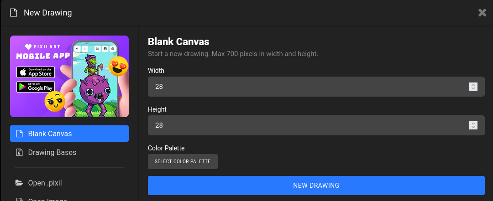
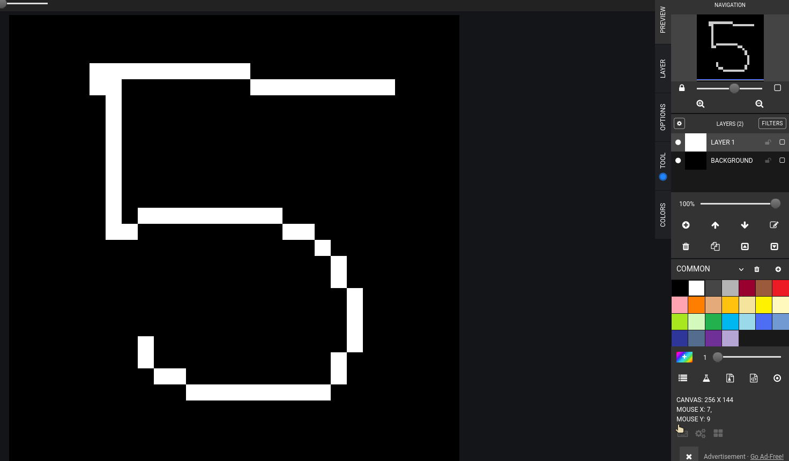
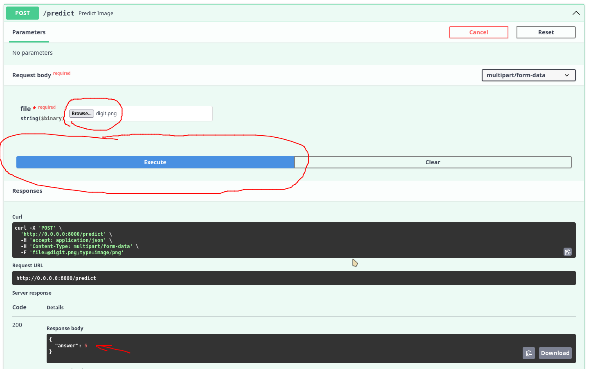
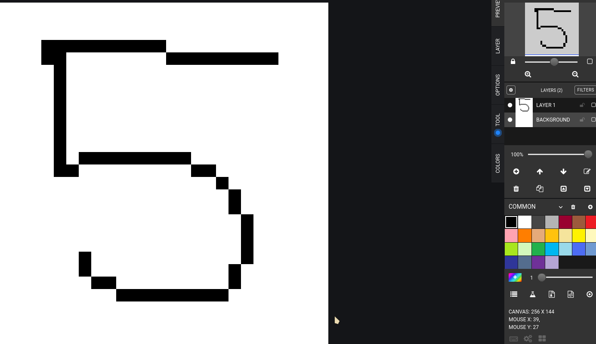
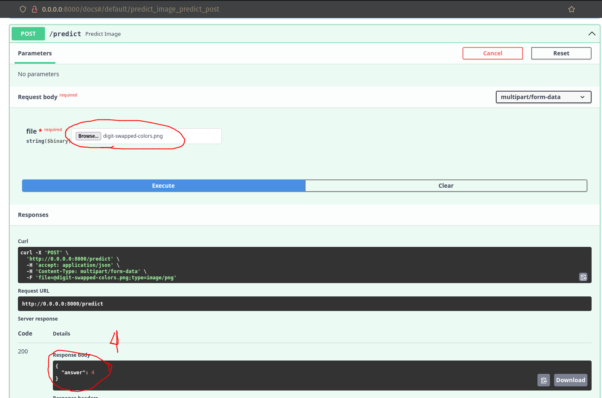

# AI Model using FastAPI and Docker

- [AI Model using FastAPI and Docker](#ai-model-using-fastapi-and-docker)
- [Python Environment](#python-environment)
- [Create the Network Weights](#create-the-network-weights)
- [Run FastAPI inside of Container](#run-fastapi-inside-of-container)
- [Create digit image](#create-digit-image)
- [Testing API](#testing-api)
- [Extra](#extra)


Application of an AI model to predict digits built in Fast API and Docker.

# Python Environment

As usual, the dependencies for the running the project is on [requeriments.txt](requeriments.txt):

- Create a new environment using your prefer environment manager and activate it:
 
```bash
$ python3 -m venv .venv
$ source .venv/bin/activate  # unix
```

- Install the dependencies:

```bash
$ pip install -r requirements.txt
```

# Create the Network Weights

You need to train the network if you want to generate the weights to be used on the API after. Run the script `train.py` and will download the [MNIST Dataset](https://en.wikipedia.org/wiki/MNIST_database) locally and execute the training of the network. In the end, will be reach something about 98% of accuracy when evaluating the model (The network is small, can be trained on modern CPUs quickly)

```
$ python train.py
```

There's now a directory called `weights/` with the weights `mnist_net.pth`.

# Run FastAPI inside of Container

I'll use here [Podman](https://docs.podman.io/en/latest/), feel free to use [Docker](https://docs.docker.com/get-started/overview/) with some adjust to the commands.

- Build the image (this will take a time because of torch framework)

```bash
$ podman build -t aimodel:v1 .
```

- Run a container with the image created

```bash
$ podman run -p 8000:8000 aimodel:v1
```

Now, you can be able to see the API docs opening `http://0.0.0.0:8000/docs` in your browser. We'll use the post-HTTP method. 

# Create digit image

But before, we need an image with a digit to test our network. I'll use the [Pixil Art](https://www.pixilart.com/draw) for creating the digit image (.png). Click on `new` and adjust the size to `28x28` (because it's a size of our network)



- Select `Bucket - B` and the color `black - RGB (0, 0, 0)` and paint all the background.
- **Optional:** You can create a `new layer` with you want to draw above the background, and you can erase without changing the background layer.
- Draw a digit and click on `file` &rarr; `export/download` and choose a directory to save the image (doesn't need to be in the same directory as the model)



# Testing API

Open the docs and click on `Try it out` &rarr; `Browse...` and select the digit image saved before &rarr; `Execute`



# Extra

- Something interesting is if you swap the colors `black <-> white` as shown in the picture below:



- If you try to predict, this image will result in the prediction of "4" instead of "5".



<details> 
  <summary>The answer because this happens:</summary>
   The trained data the background is black, and we're try predicting a image that is out of distribution. You can read more here: <a href="https://d2l.ai/chapter_linear-classification/environment-and-distribution-shift.html"> 4.7. Environment and Distribution Shift</a>
</details>

---
<div align="center">
  <strong>"PEOPLE'S DREAMS WILL NEVER END" - OP</strong>
</div>
<p align="center">
  <sub>Created by BrenoAV</sub>
</p>
